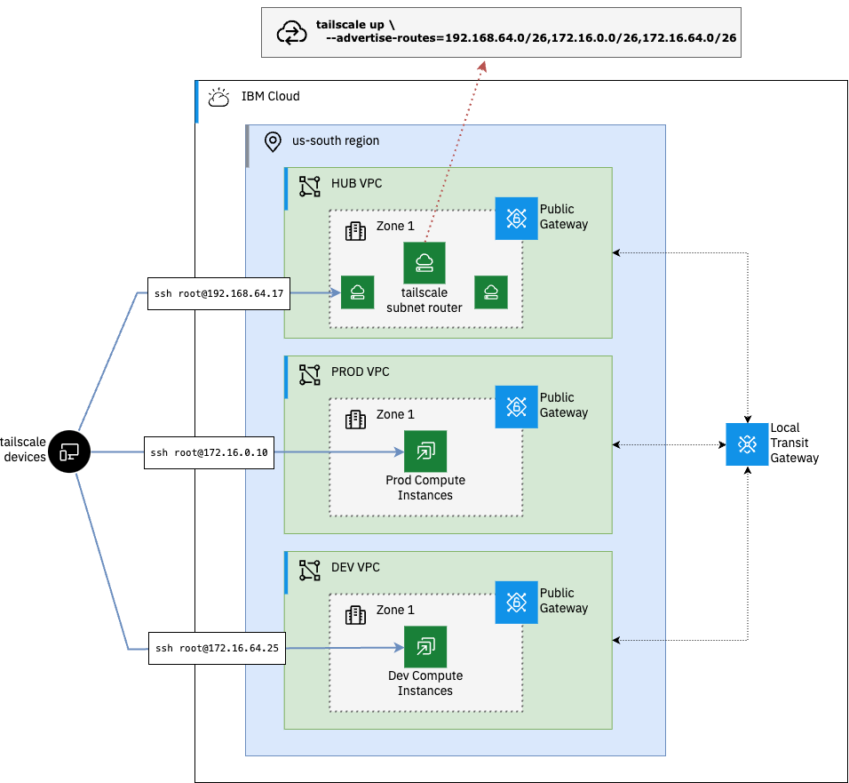

# Deploy a Tailscale Subnet Router for multi-VPC connectivity

 - [ ] Step 1: think of a better title

## Overview

Use the Tailscale [Subnet Router](https://tailscale.com/kb/1019/subnets) feature to expose routes across multiple VPCs. Subnet routers act as a gateway, relaying traffic from your tailnet to the VPC subnets without the need for each device to be running the tailscale agent.

In this example we will connect a `hub` VPC, where our Subnet Router instance is running, to our `prod` and `dev` VPCs in the same region via a local IBM Cloud [Transit Gateway](https://cloud.ibm.com/docs/transit-gateway?topic=transit-gateway-about&interface=cli). 

## Diagram



## Pre-reqs

- [ ] IBM Cloud [API Key](https://cloud.ibm.com/docs/account?topic=account-userapikey&interface=ui#create_user_key)
- [ ] Tailscale [API Key](https://login.tailscale.com/admin/settings/keys)
- [ ] Terraform [installed](https://developer.hashicorp.com/terraform/install) locally

## Getting started

### Clone repository and configure terraform variables

The first step is to clone the repository and configure the terraform variables.

```shell
git clone https://github.com/cloud-design-dev/ibmcloud-vpc-ts-router.git
cd ibmcloud-vpc-ts-router
```

Copy the example terraform variables file and update the values with your own.

```shell
cp tfvars-template terraform.tfvars
```

#### Variables 

| Name | Description | Type | Default | Required |
|------|-------------|------|---------|:--------:|
| <a name="input_dev_prefix"></a> [dev\_prefix](#input\_dev\_prefix) | The address prefix to use for the dev\_vpc VPC | `string` | `"172.16.64.0/18"` | no |
| <a name="input_existing_resource_group"></a> [existing\_resource\_group](#input\_existing\_resource\_group) | The IBM Cloud resource group to assign to the provisioned resources. | `string` | n/a | yes |
| <a name="input_existing_ssh_key"></a> [existing\_ssh\_key](#input\_existing\_ssh\_key) | The name of an existing SSH key to use for provisioning resources. If one is not provided, a new key will be generated. | `string` | `""` | no |
| <a name="input_hub_prefix"></a> [hub\_prefix](#input\_hub\_prefix) | The address prefix to use for the hub VPC | `string` | `"192.168.0.0/18"` | no |
| <a name="input_ibmcloud_api_key"></a> [ibmcloud\_api\_key](#input\_ibmcloud\_api\_key) | The IBM Cloud API key to use for provisioning resources | `string` | n/a | yes |
| <a name="input_ibmcloud_region"></a> [ibmcloud\_region](#input\_ibmcloud\_region) | The IBM Cloud region to use for provisioning VPCs and other resources. | `string` | n/a | yes |
| <a name="input_prod_prefix"></a> [prod\_prefix](#input\_prod\_prefix) | The address prefix to use for the prod\_vpc VPC | `string` | `"172.16.0.0/18"` | no |
| <a name="input_project_prefix"></a> [project\_prefix](#input\_project\_prefix) | The prefix to use for naming resources. If none is provided, a random string will be generated. | `string` | `""` | no |
| <a name="input_tailscale_api_key"></a> [tailscale\_api\_key](#input\_tailscale\_api\_key) | The Tailscale API key | `string` | n/a | yes |
| <a name="input_tailscale_tailnet_id"></a> [tailscale\_tailnet\_id](#input\_tailscale\_tailnet\_id) | The Tailscale tailnet ID | `string` | n/a | yes |


### Initialize, Plan and Apply the Terraform configuration


### Testing connectivity to compute instances

### Clean up

## Conclusion 
